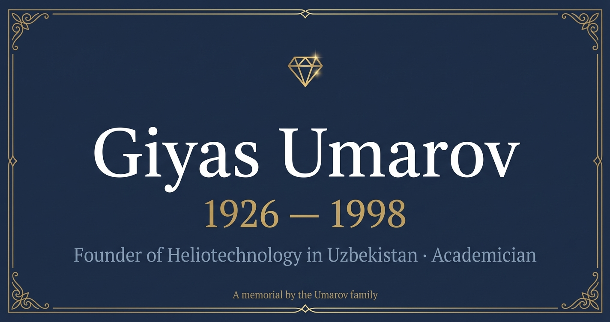

# Giyas Umarov Memorial

**🌐 Live: [www.giyas-umarov.com](https://www.giyas-umarov.com)**

A memorial website dedicated to **Academician Giyas Yakubovich Umarov (1921–1988)** — pioneering Soviet/Uzbek nuclear physicist and founder of heliotechnology (solar energy science) in Uzbekistan.



## About

Giyas Umarov was a man whose life traced the arc of a nation's scientific awakening. Born in Tashkent, he rose from a young Uzbek student in postwar Leningrad to become the first candidate of sciences in nuclear physics in all of Uzbekistan, and ultimately the founder of an entirely new field: heliotechnology — the science of harnessing the sun.

He built the **"Big Solar Furnace"** in the mountains above Tashkent — a 1 MW concentrating solar facility that remains one of only two of its kind in the world (the other is in Odeillo, France). He founded the Institute of Solar Energy, served as Academician of the Uzbek Academy of Sciences, and authored over 300 scientific works.

Beyond physics, he championed the use of solar energy for agriculture (drying fruits, heating greenhouses), contributed to Aral Sea research, and was a devoted patron of Uzbek arts and culture.

## Features

- 📖 **Comprehensive biography** — Nuclear physics, solar energy, agriculture, Aral Sea, culture
- ☀️ **Heliotechnology section** — The Big Solar Furnace and solar energy research
- ⚛️ **Nuclear physics** — First Uzbek nuclear physicist, Leningrad training
- 🌊 **Aral Sea** — Environmental research contributions
- 🎭 **Culture & arts** — Patronage of Uzbek cultural institutions
- 📸 **Photo gallery** — Historical photographs including last photo (1988)
- 📚 **Works & publications** — Selected bibliography
- 🌍 **Multilingual** — English with Uzbek/Russian elements
- 🌓 **Dark/light mode** — Sun-themed toggle
- 📱 **Fully responsive** — Mobile-first design
- ⚡ **Static site** — Single HTML file, no build step

## Key Achievements

| Achievement | Details |
|-------------|---------|
| **First in nuclear physics** | First candidate of sciences in nuclear physics in Uzbekistan |
| **Big Solar Furnace** | 1 MW concentrating solar facility — one of only two in the world |
| **Institute of Solar Energy** | Founded and directed the research institute |
| **Academician** | Full member, Academy of Sciences of Uzbek SSR |
| **300+ publications** | Scientific works across nuclear physics, solar energy, agriculture |
| **International recognition** | Work cited at Davos; French counterpart facility at Odeillo |

## Career Timeline

| Period | Role |
|--------|------|
| 1940s | Studies physics in Leningrad (postwar) |
| 1950s | First Uzbek candidate of sciences in nuclear physics |
| 1960s | Founds heliotechnology research program |
| 1970s | Builds the Big Solar Furnace; directs Institute of Solar Energy |
| 1980s | Academician; Aral Sea research; cultural patronage |
| 1988 | Dies in Tashkent |

## Tech Stack

- Pure HTML/CSS/JavaScript (no framework)
- Hosted on [Vercel](https://vercel.com)
- Custom domain via Vercel DNS
- SVG favicon, Gemini-generated OG image

## Family

Giyas Umarov is the grandfather of the Umarov family. His legacy in science connects with the broader family heritage of service.

**Related memorials:**
- [Aminjan Niyazov](https://www.amin-niyazov.com) — First Secretary of CP Uzbekistan (1903–1973)
- [Gulom Bobojonov](https://www.gulam-babodjanov.com) — Rector, Scientist of Silk (1907–1955)

## Deploy

```bash
npx vercel --prod
```

## License

© 2024 Umarov Family. All rights reserved.
